# Exact Data Pipeline — `kalshi_arb`

Every step the data passes through, in order, as implemented (post smile-unification).
One smile per day feeds pricing, GBM, and the BL density — no second smoother, no
duplicate paths. Generated/verified during the phase-by-phase walkthrough.

```mermaid
flowchart TD

%% ================= STAGE 1: EXTRACT =================
subgraph EX["① EXTRACT — pull raw data per source"]
  R0[("spx_w/eoy_chains.csv")] --> R1["refinitiv.load_raw_chain()<br/>coerce numerics · parse dates · sort by quote,strike"]
  R1 --> RAW["RAW CHAIN · one row per option-quote<br/>Ask, Bid, ImpliedVol(%), quote, exp, T(days),<br/>option_type, strike, underlying(spot), DF, div, fwd"]
  K0[("kalshi_data.pkl")] --> K1["kalshi.load_kalshi()<br/>datetime index"]
  K1 --> KAL["KALSHI ORDER BOOK · per year<br/>bid / ask / price = date × 13 buckets (cents)"]
end

%% ================= STAGE 2a: CLEAN =================
subgraph CL["② CLEAN — clean.clean_chain()"]
  RAW --> C1["1 · drop rows missing Bid AND Ask AND IV"]
  C1 --> C2["2 · _restrict_to_current_year_expiry<br/>keep exp.year == quote.year (drops Dec roll-over)"]
  C2 --> C3["3 · _transform (units + derived)<br/>IV÷100 · T÷365 · r = −ln(DF)/T<br/>underlying = spot − div·DF · forward = underlying·e^(rT)<br/>moneyness = K/F (call) or 2−K/F (put)"]
  C3 --> C4["4 · _mid_price<br/>both sides → (Bid+Ask)/2<br/>one side → present/2, kept iff |BSM(vendorIV) − Mid| ≤ $0.50"]
  C4 --> C5["5 · liquidity filter<br/>drop both-sided where (Ask−Bid)/Mid > 0.30"]
  C5 --> C6["6 · moneyness filter<br/>drop |moneyness − μ| > 2σ (global)"]
  C6 --> C7["7 · _drop_arbitrage_violations<br/>keep intrinsic ≤ Mid ≤ upper (exact no-arb box)"]
  C7 --> C8["8 · _backfill_iv<br/>IV missing & Mid ok → bisection-invert BSM"]
  C8 --> CLEAN["CLEAN CHAIN<br/>+ IV, r, spot, forward, moneyness, Mid"]
end

%% ================= STAGE 2b: SMOOTH (single smile) =================
subgraph SM["③ SMOOTH — smoothing (ONE smile per day, reused everywhere)"]
  CLEAN --> S1["fit_daily_smile(day)<br/>OTM-combined: puts strike under F, calls strike at/above F<br/>SMILE_METHOD (default SABR; swappable: svi/lsq/cubic/poly/pchip/lowess)"]
  S1 --> CURVE(["fitted smile · k_min, k_max, iv_min, iv_max"])
  CURVE --> S2["eval_smile(curve, all strikes)<br/>clamp strike ∈ [k_min,k_max] (flat wings)<br/>clamp IV ∈ [iv_min,iv_max] (envelope; kills spline overshoot)"]
  S2 --> LSQ["CHAIN + LSQ_Vol"]
end

%% ================= STAGE 2c: PRICE =================
subgraph PR["④ PRICE — pricing.price_chain()"]
  LSQ --> P1["BSM = bsm_price(option_type, underlying, K, T, r, LSQ_Vol)<br/>pure model price — no blend toward Mid"]
  P1 --> PRICED["PRICED CHAIN + BSM  ·  (single source of truth: pipeline.build_chain)"]
end

%% ================= STAGE 2d: DENSITY / PMFs =================
subgraph DEN["⑤ DENSITY — density.build_pmf_table(method) · EXACT same-calendar-day chain only (no fill)"]
  PRICED --> D0{{"for each year,<br/>each Kalshi date with a same-day chain"}}
  CURVE -. "same fit_daily_smile" .-> DBL
  D0 --> DBL["bl_density  (PRIMARY)<br/>grid = [k_min−2000 , k_max+1000] × 5000<br/>σ = eval_smile(grid) · C = BSM_call(S,grid,T,r,σ)<br/>fp = clip(dC/dK, −DF, 0) → isotonic ↑ (convex C)<br/>dens = clip(e^(rT)·d²C/dK², 0) → smooth(25) → trim<br/>P([L,U]) = ∫ dens"]
  D0 --> DGB["gbm_pmf  (benchmark)<br/>σ = LSQ_Vol at strike nearest F (ATM)<br/>lognormal: P = Φ(d(U)) − Φ(d(L)), S0 = underlying"]
  DBL --> MPMF["MODEL PMF · date × bucket<br/>bucket priced only if it overlaps [k_min,k_max] (coverage guard), else NaN"]
  DGB --> MPMF
end

%% ================= STAGE 3: STRATEGY =================
subgraph ST["⑥ STRATEGY"]
  MPMF --> G1["signals.generate(side)<br/>buy iff model_p > ask + h · sell iff model_p < bid − h<br/>h = entry_hurdle = 2·fee/|C| (PER CONTRACT, round trip)<br/>fee = ⌈0.035·|C|·100·p(1−p)⌉ / 100 (whole lot, $)"]
  KAL --> G1
  G1 --> TR["TRADES (raw signal log; re-fires daily)"]
  TR --> B1["backtest.run<br/>execute with no-pyramiding cap · cash −= qty·price + fee<br/>mark = valid-book mid → last valid mid → model<br/>monthly APY on PV · settle $1 if close ∈ [L,U]"]
  MPMF --> B1
  KAL --> B1
  B1 --> PV["portfolio_value (MtM+APY) · model_value · cash<br/>attrs: settlement · final_value · n_executed · n_signals"]
  PV --> M1["metrics.summarize<br/>ann ret/vol/Sharpe (×252) · strategy max-DD<br/>alpha/beta vs SPX spot · model ρ · total_return (incl. settlement)"]
  M1 --> OUT["PERFORMANCE TABLE  ·  run.full() orchestrates all"]
end

%% ================= SIDE: ANALYSIS (not traded legs) =================
subgraph HG["⑦ HEDGING — hedging.analyze_year (independent cross-market check)"]
  PRICED --> H1["replicate_bucket → SPX call condor (payoff 1 in-range)<br/>edge = Kalshi price − condor mid · basis risk"]
  KAL --> H1
end

subgraph AN["⑧ COINTEGRATION — analysis/cointegration.py (lead-lag study)"]
  KAL --> KP["kalshi_pmf.market_pmf<br/>mid of a valid book;<br/>empty book (bid ≤ 2c & ask ≥ 98c) or missing → NaN"]
  KP --> KPMF["MARKET PMF · date × bucket"]
  KPMF --> C1["spread = Kalshi mid − model p<br/>ADF · half-life · error-correction (who leads)"]
  MPMF --> C1
end

classDef art fill:#eef,stroke:#557;
class RAW,KAL,CLEAN,LSQ,PRICED,CURVE,MPMF,KPMF,TR,PV,OUT art;
```

## Notes / invariants (what the diagram guarantees)

- **One smile, one place.** `fit_daily_smile` (OTM-combined, 6 knots) is called by
  both `smooth_chain` (→ `LSQ_Vol`, feeding pricing + GBM ATM vol) and `bl_density`
  (dashed edge). There is no second smoother and no per-type fit.
- **`pipeline.build_chain()`** is the single source of the cleaned+smoothed+priced
  chain; everything downstream consumes it.
- **No calendar fill.** `build_pmf_table` prices a Kalshi date only if a same-day
  option chain exists (weekends/holidays/Dec-gap → NaN → no new signal).
- **Existing positions still mark & settle every day**; only *new* signals need a
  same-day chain.
- **Hedging is detached by design** — an analysis of cross-market dislocation, not a
  leg the backtest trades.
- **The market PMF is analysis-facing, not traded.** `signals.generate` compares the
  model probability to the price it would actually pay (ask) or receive (bid), so it
  reads the raw book directly; `market_pmf`'s mid would understate execution cost.
  The mid PMF exists to put both venues on one footing for the cointegration study.
- **One book-validity rule.** `kalshi_pmf.is_valid_book` is the single definition
  (missing quote, or bid ≤ 2c *and* ask ≥ 98c → not a real market); `backtest.run`
  imports it for marking, so the traded and analysis paths cannot drift apart.
- **The fee hurdle is per CONTRACT, the fee itself is per LOT.** `kalshi_fee` returns
  dollars for the whole lot (which is what `backtest.run` spends); `entry_hurdle`
  divides by the lot and doubles it for the round trip. Mixing the two units was a
  real bug (fixed Phase 7) that demanded 8× the break-even edge.
- **The backtest index is a CALENDAR-day index** (365/366 rows incl. ~105 weekend
  days), because Kalshi trades 24/7. New signals fire only on the ~240 weekdays with
  a same-day option chain, but positions mark on every calendar row — so the ×252
  annualization in `metrics` is under review (Phase 9).
